# Investment View (Alpha version)

Welcome to the official repository for the **Investment View** application, available for both Android and Windows platforms.

This application provides users with a comprehensive suite of tools designed to seamlessly monitor and manage financial investments. The following capabilities are currently offered across our supported platforms.

> **Latest release:** [Android & Windows v0.29](https://github.com/nicosrsdev/InvestmentView/releases/latest)  
> **Repository:** [nicosrsdev/InvestmentView](https://github.com/nicosrsdev/InvestmentView)  
> **Image Gallery:** [InvestmentView Screenshots](https://nicosrsdev.github.io/InvestmentView/)

---

## Watchlist

Monitor and analyze the performance of your selected assets:

- **Asset Tracking:** Monitor the status of up to six distinct stock market items simultaneously.
- **Historical Data:** Access detailed performance tables spanning the last 15 years.
- **Year-over-Year Analysis:** Review yearly evolutionary metrics and trends.
- **Short and Long-Term Metrics:** Track percentage gains (green for positive growth and red for negative growth) and asset prices across flexible timeframes, ranging from a single day to 10 years.
- **Comparative Insights:** Compare percentage gains and pricing trends across multiple years for individual assets.

<table>
  <tr>
    <td valign="top">
      <a href="screenshots/watchlist/watchlist01.png">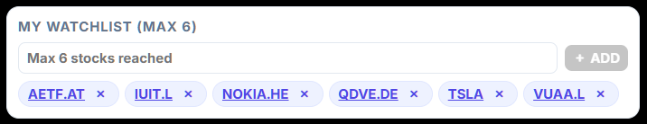</a> 
      <a href="screenshots/watchlist/watchlist04.png">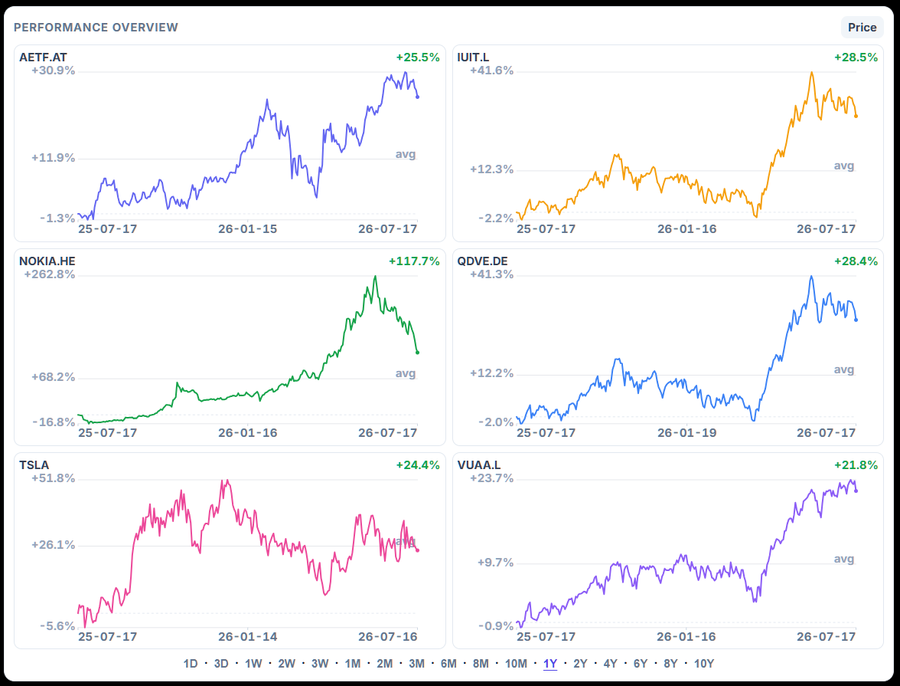</a>
    </td>
    <td valign="top">
      <a href="screenshots/watchlist/watchlist02.png">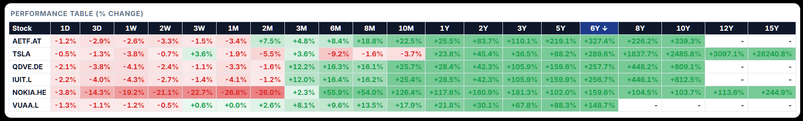</a> 
      <a href="screenshots/watchlist/watchlist03.png">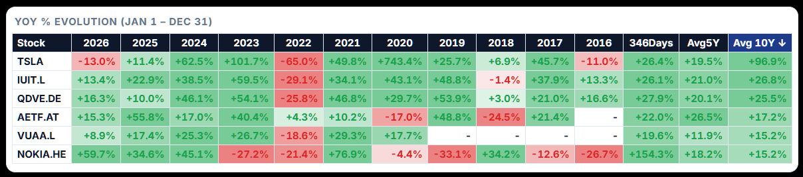</a>
    </td>
  </tr>
  <tr>
    <td valign="top">
      <a href="screenshots/watchlist/watchlist05.png">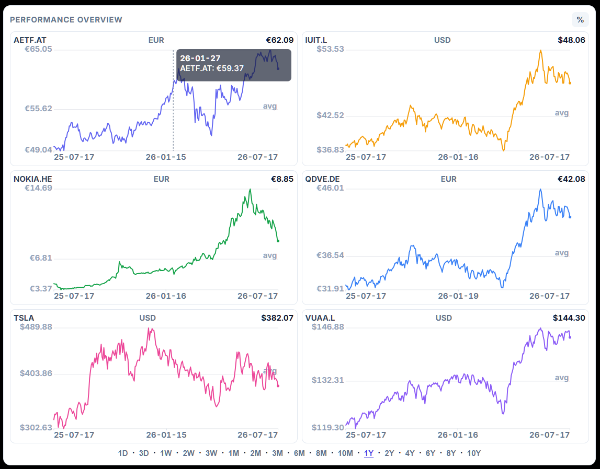</a>
    </td>
    <td valign="top">
      
    </td>
  </tr>
  <tr>
    <td valign="top">
      <a href="screenshots/watchlist/watchlist07.png">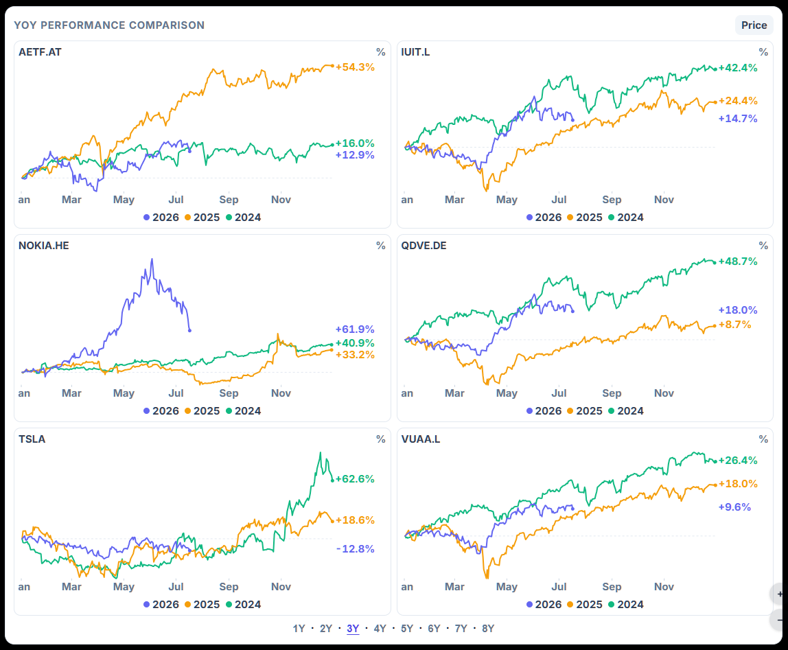</a>
    </td>
    <td valign="top">
      <a href="screenshots/watchlist/watchlist08.png">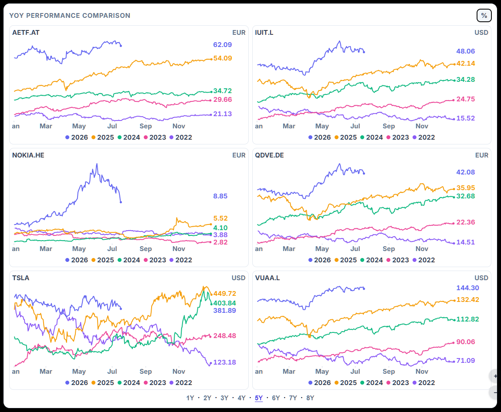</a>
    </td>
  </tr>
</table>

---

## My Portfolio

Maintain complete oversight of your personal investments:

- **Comprehensive Overview:** View the real-time, overall status of your entire investment portfolio.
- **Granular Tracking:** Analyze both the overall and per-transaction status of each individual stock market item.
- **Growth Visualization:** Visualize portfolio growth over six-month periods, featuring detailed graphs that illustrate the evolution of your principal investments versus accrued interest.
- **Portfolio Segmentation:** Create and manage up to five distinct portfolio groups, allowing for the independent tracking of their respective statuses and evolutionary trends.

<table>
  <tr>
    <td valign="top">
      <a href="screenshots/portfolio/portfolio01.png">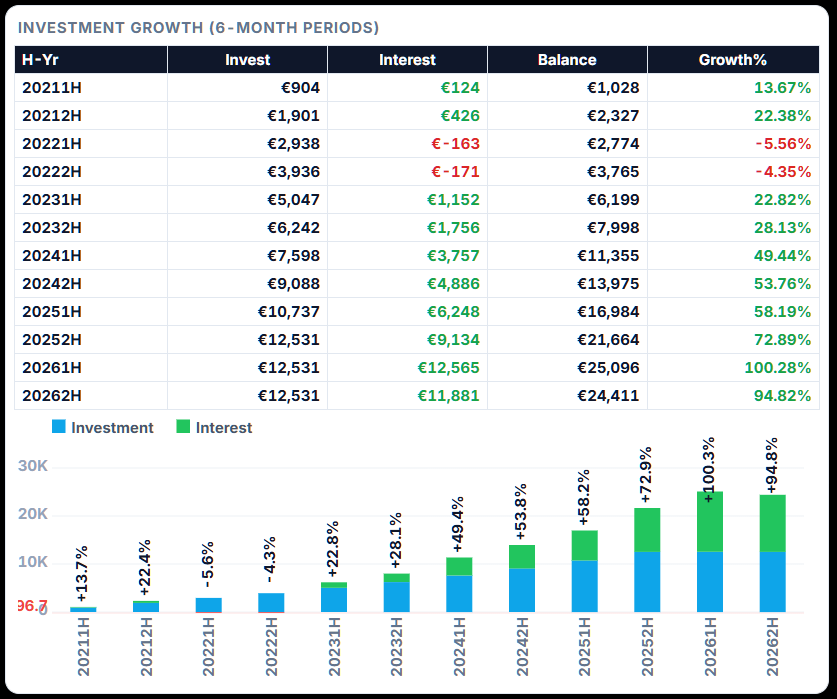</a>      
    </td>
    <td valign="top">
      <a href="screenshots/portfolio/portfolio02.png">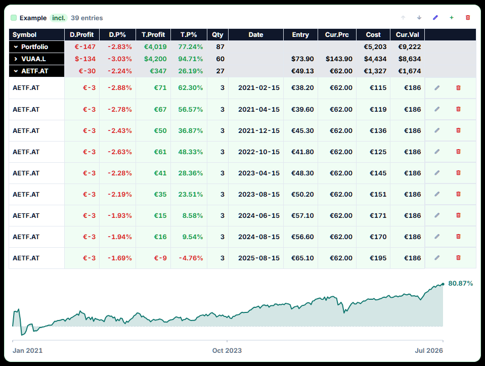</a>
    </td>
  </tr>
</table>

---

## Backup and Data Management

Ensure your financial data is always secure and up-to-date:

- **Import/Export Functionality:** Seamlessly export and import data using Excel and JSON file formats. This feature allows users to easily update, back up, and migrate their portfolio transactions across devices.

<a href="screenshots/backup/backup01.png">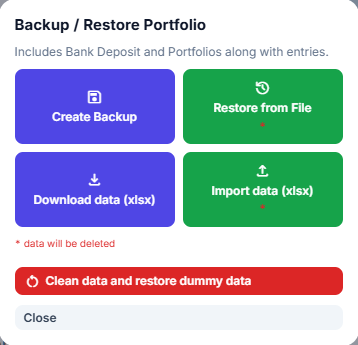</a>

---

## Windows-Exclusive Features

Users operating the Windows desktop application benefit from the following additional capabilities:

- **System Tray Integration:** Receive convenient system tray notifications for quick, at-a-glance updates on your tracked assets.
- **Customizable Alerts:** Set up automated alerts for daily market fluctuations, notifying you instantly of ±1% to 5% changes in asset value.

<a href="screenshots/windows/windows01.png">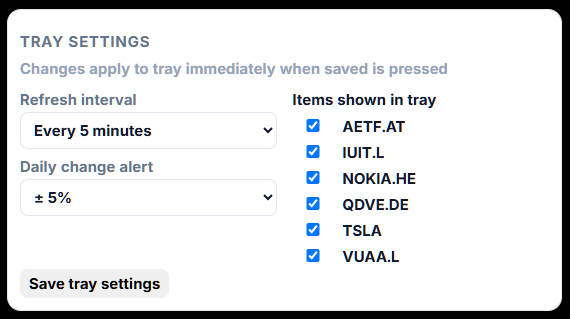</a>
<a href="screenshots/windows/windows02.png">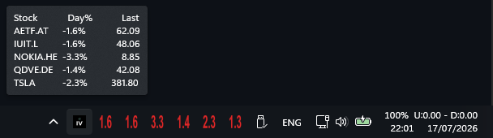</a>
<a href="screenshots/windows/windows03.png">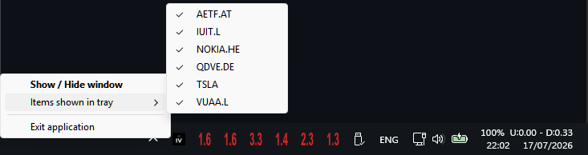</a>

---

## Legal Disclaimer & Terms of Use

### 1. For Educational and Informational Purposes Only

The InvestView application (hereinafter referred to as "the Application") and its built-in calculation tools are provided strictly for educational, informational, and offline calculation purposes. The Application does not provide financial, investment, legal, or tax advice.

### 2. No Warranties and Limitation of Liability

While every effort is made to ensure the accuracy of the mathematical formulas and calculations within the Application, errors, omissions, or technical inaccuracies may occur.

The developer of this Application makes no warranties, express or implied, regarding the accuracy, completeness, or reliability of any calculation results.

Under no circumstances shall the developer be held legally or financially liable for any direct, indirect, incidental, or consequential losses, damages, or expenses incurred as a result of relying on the Application's calculations.

### 3. Investment Risks and User Responsibility

Financial markets involving stocks, Exchange-Traded Funds (ETFs), and other investment packages carry inherent risks.

Financial performance can fluctuate; indicators showing positive growth or negative growth based on historical or manual data inputs do not guarantee future market results.

The user assumes sole responsibility for any buying, selling, or trading decisions they execute.

### 4. Requirement for Professional Consultation

The creator of this Application is an independent software developer, not a licensed financial advisor or broker. Before making any real-world financial commitments or investments, users are strongly advised to seek independent, professional guidance from certified financial planners, legal advisors, or authorized wealth management experts.

### 5. Data Privacy and Local Storage

The Application operates entirely without dedicated backend servers. All information the user enters is stored locally on the user's own device and can be conveniently exported and imported using the Excel and JSON file formats.

No personal or portfolio data is transmitted to, collected by, or stored outside the Application. The user retains full ownership of, and responsibility for, their data at all times.

Please note that the Application does require an active internet connection to retrieve stock market data from third-party online services that provide free API access.

The user is solely responsible for safeguarding, backing up, and maintaining their personal data on their local machine.

By continuing to use the InvestView application, you acknowledge that you have read, understood, and agreed to this disclaimer, and you release the developer from any and all liability regarding your financial decisions.
